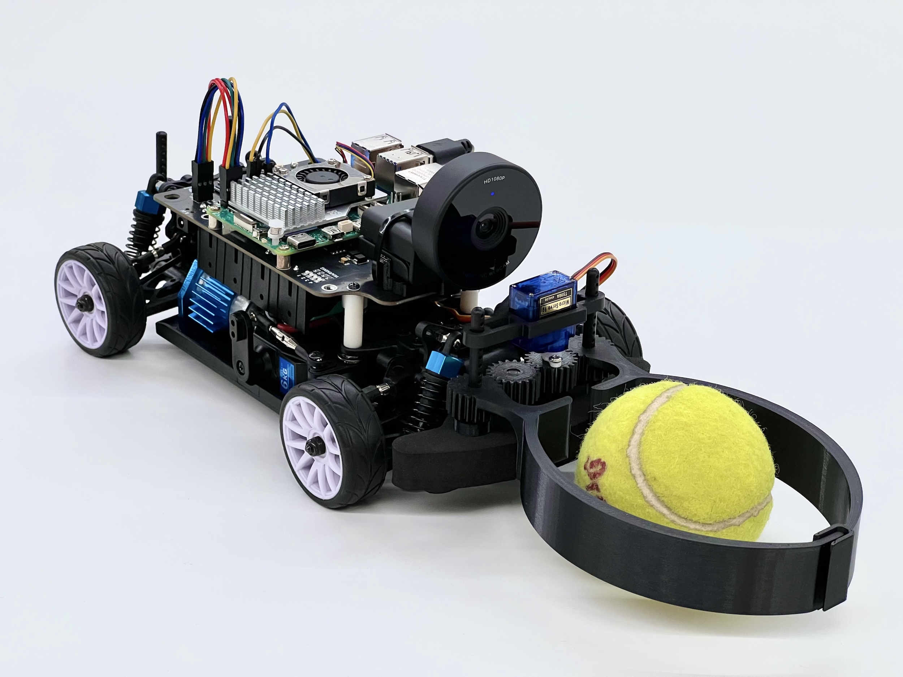
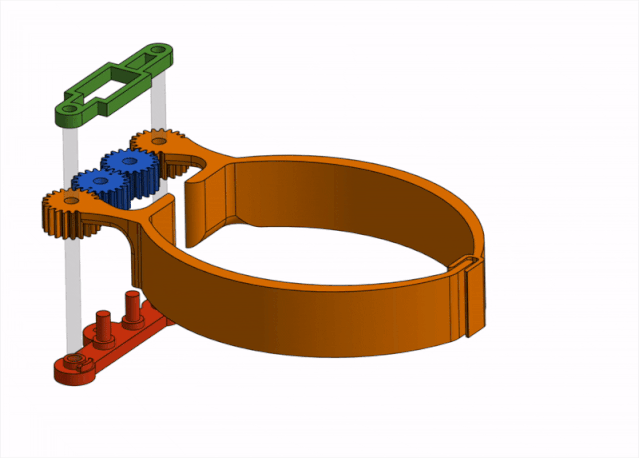
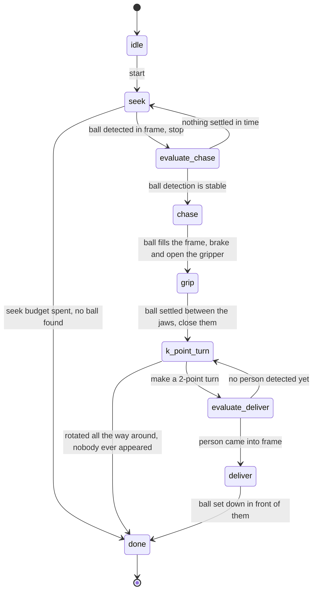
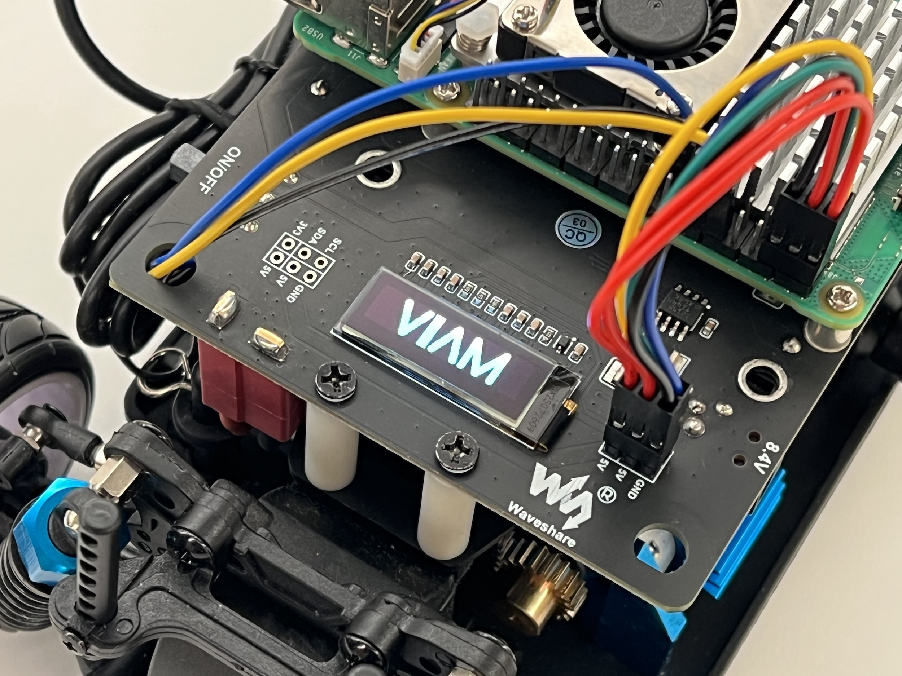

# Hawkeye

Hawkeye is an autonomous Viam-powered RC car that fetches tennis balls.

For Viam developers: the machine configuration is defined under [`viam-dev/Evgeni/hawkeye`](https://app.viam.com/machine/28bc42b7-1b89-4adc-b695-446b18d96ba1/configure).



## Demo

Some onboard footage of a fetch routine with the states displayed in the top left. See [Architecture](#architecture) for more details.


## Hardware

- A Waveshare PiRacer Pro Kit
- Four flat top 18650 batteries (e.g. [Samsung 25R from 18650BatteryStore](https://www.18650batterystore.com/products/samsung-25r-18650))
- A Raspberry Pi 5
- A Raspberry Pi 5 Official Active Cooler
- An 8 GB microSD card
- An EMEET SmartCam C950
- A TianKongRC TS90A 9g micro servo
- A ziptie and a couple small screws to mount the webcam
- Access to a 3D printer to make the parts in the [`3d`](3d) folder

### Gripper

The gripper mechanism is a set of custom 3D-printed parts retrofitted to the PiRacer's front bumper. It consists of a micro servo mounting bracket (green), a driver gear and an idler gear (blue), the gripper jaws (orange), and a plate (red). Most standard printer settings will work fine (PLA or PETG filament; 0.4-0.6mm nozzle; 0.15mm layer height; 15% infill; no supports; no brims).



## Terminology

| Term            | Definition                                                                                                                                                                                                                                                                                                         |
| --------------- | ------------------------------------------------------------------------------------------------------------------------------------------------------------------------------------------------------------------------------------------------------------------------------------------------------------------ |
| Hawkeye         | The software that controls the hardware. Consists of the machine defined on the Viam platform ([`viam-dev/Evgeni/hawkeye`](https://app.viam.com/machine/28bc42b7-1b89-4adc-b695-446b18d96ba1/configure)) and the business logic in this repo to integrate the hardware components.                                 |
| PiRacer         | The pre-assembled RC car kit that contains all of the hardware components.                                                                                                                                                                                                                                         |
| Raspberry Pi    | The onboard computer that sits on top of the PiRacer. Its hostname is `piracer` in the examples below.                                                                                                                                                                                                             |
| Expansion board | The board that sits between the batteries and the Raspberry Pi on the PiRacer. It contains a PCA9685 PWM driver (16 PWM channels over I2C), an INA219 power monitor for reading battery voltage, the main power switch, and the BMS (Battery Management System) that protects the batteries.                       |
| PWM             | Pulse Width Modulation. A digital square wave whose duty cycle (the fraction of each period spent high) encodes an analog value — here, a servo angle or a throttle setpoint. The PCA9685 on the expansion board generates the PWM signals for the steering servo and the ESC.                                     |
| I2C             | A two-wire serial bus (SCL clock + SDA data) for talking to low-speed peripherals. Each device on the bus has its own address. Hawkeye uses three I2C devices on the Pi's default bus: the PCA9685 at `0x40` (PWM driver), the INA219 at `0x42` (battery voltage), and the SSD1306 at `0x3C` (128x32 OLED screen). |
| ESC             | Electronic speed controller. The small black box on the chassis that converts a PWM signal into the drive signals for the brushed motor. Needs an arming signal before it will accept drive commands — see the FAQ at the bottom for details.                                                                      |
| Servo           | A small motor with built-in closed-loop position control. It takes a PWM signal and holds the corresponding angle. The PiRacer uses one servo for steering; the ESC's drive output is also controlled like a servo (PWM in, throttle out), which is why both show up as `servo` in the Viam config.                |
| Motor           | The brushed DC motor that drives the rear wheels through the differential. Powered by the ESC.                                                                                                                                                                                                                     |

## Architecture

Hawkeye is organized around **routines** — independent units of behavior that each own a hardware component. There are seven of them:

| Routine    | Hardware             | Viam dependency                                                    | What it does                                                                                                                                                                                                              |
| ---------- | -------------------- | ------------------------------------------------------------------ | ------------------------------------------------------------------------------------------------------------------------------------------------------------------------------------------------------------------------- |
| `battery`  | INA219 power monitor | (direct I2C)                                                       | Reads pack voltage on a tick and publishes it, so `screen` can render it.                                                                                                                                                 |
| `fetch`    | —                    | —                                                                  | The state machine that drives a whole fetch. The only routine that reads detections and turns them into servo angles for the others to apply.                                                                             |
| `gripper`  | Gripper servo        | `servo_gripper` component                                          | Applies the last gripper angle published by the `fetch` routine to `servo_gripper`.                                                                                                                                       |
| `motor`    | ESC (as a servo)     | `servo_motor` component                                            | Applies the last drive angle published by the `fetch` routine to `servo_motor`.                                                                                                                                           |
| `screen`   | SSD1306 OLED         | (direct I2C)                                                       | Redraws the OLED with the Viam logo, the battery level, or one of the `fetch` state icons (an eye when seeking, a rolling tennis ball when evaluating, etc).                                                              |
| `steering` | Steering servo       | `servo_steering` component                                         | Applies the last steering angle published by the `fetch` routine to `servo_steering`.                                                                                                                                     |
| `vision`   | Camera               | `camera` component, `vision_ball` service, `vision_person` service | Asks the selected `vision_*` service for detections and publishes one bounding box: the largest one for the ball, or the pair of shoes merged into one for the person. Optionally records annotated frames from `camera`. |

Each routine runs its tick function on a fixed cadence via [`util.Routine`](util/routine.go) and is independently startable, stoppable, and testable.

Routines never call each other. They communicate only through `atomic.Pointer` fields on the shared `hawkeye` struct: `visionLastDetection`, `steeringDesiredAngle`, `motorDesiredAngle`, `gripperDesiredAngle`, `screenDesiredImage`, `batteryLastReading`, `fetchState`. The vision routine writes the latest detection; `fetch` reads it and publishes servo angles; `steering` and `motor` apply whatever they find on their own next tick. Maintaining the latest state this way minimizes staleness in the system.

`fetch` is the exception to the hardware rule, being a state machine:



## Running and testing

### Booting

Toggle the ON/OFF switch on the expansion board by the rear left wheel. The Raspberry Pi's LEDs will turn on and there'll be a quick beep indicating that the ESC is receiving power. Check the [FAQ](#faq) if not.

The Raspberry Pi and `viam-agent` take 30-40 seconds to finish booting. The Viam logo will appear on the screen along with a longer beep indicating that the ESC is armed.



### Invoking commands

Hawkeye registers `viam:tennis:hawkeye` as a single `rdk:service:generic` model and exposes all of its behavior through `DoCommand`. Every command has the same shape:

```jsonc
{
  "command":  "start" | "stop" | "test",
  "routines": { "<routine>": { "<args>" } }
}
```

- `start` / `stop` can address multiple routines in one call — they're dispatched in deterministic (sorted-key) order, best-effort, so a failure in one routine doesn't skip the others.
- `test` requires exactly one routine and runs synchronously. It's meant for ad-hoc hardware exercises (do a driving sequence, draw something on the screen).

From the CLI, an invocation looks like:

```bash
viam robot part run \
  --robot "<robot-id>" --part "<part-id>" \
  --data '{ "command": "test", "routines": { "vision": { "detect": "single" } } }' \
  viam.service.generic.v1.GenericService/DoCommand
```

> ⚠️ Warning! Starting the `motor` routine will usually make the PiRacer move. Make sure the wheels are suspended in the air or that there's ample space.

Per-routine argument shapes, along with their defaults and validation rules, live in [`src/command_args.go`](src/command_args.go).

#### Example: full fetch routine

Run a full fetch with every routine, recording annotated frames as shown in [Demo](#demo):

```jsonc
{
  "command": "start",
  "routines": {
    "battery": {},
    "fetch": {},
    "gripper": {},
    "motor": {},
    "screen": {},
    "steering": {},
    "vision": { "record_dir": "/home/piracer/fetch" },
  },
}
```

`record_dir` takes an absolute path and is what turns recording on; omit it and nothing is written. The vision routine keeps writing until it's stopped, and logs the `ffmpeg` invocation that assembles the images in the directory into a video.

#### Example: k-point turn test

Drive one unit of the k-point turn by hand, without vision in the loop — swing out forward on full left lock, brake, back up on full right lock, then swing out again:

```jsonc
{
  "command": "test",
  "routines": {
    "motor": {
      "sequence": [
        { "action": "forward", "motor_angle": 104, "steering_angle": 115, "duration_secs": 0.5 },
        { "action": "brake", "steering_angle": 115, "duration_secs": 0.5 },
        { "action": "reverse", "motor_angle": 71, "steering_angle": 85, "duration_secs": 0.5 },
        { "action": "forward", "motor_angle": 104, "steering_angle": 115, "duration_secs": 0.5 },
      ],
    },
  },
}
```

The brake is required: the ESC won't accept reverse straight out of a forward drive, so a `reverse` step has to be preceded by one.

### Deploying

For quick iteration, the [`Makefile`](Makefile) provides a fast cross-compile-and-deploy loop:

```bash
make deploy-remote
```

This cross-compiles the module for `linux/arm64` in Docker, stops `viam-agent` on the PiRacer, scps the binary to `/home/piracer/bin/run`, and restarts the agent. To avoid typing the PiRacer's ssh password on every deploy, do this once:

```bash
ssh-keygen -t ed25519  # only if ~/.ssh/id_ed25519 doesn't already exist
ssh-copy-id piracer@piracer.local
```

After deploying, invoke routines using the payloads from [Invoking commands](#invoking-commands).

### On-device debugging

You can ssh into the PiRacer directly:

```bash
ssh piracer@piracer.local
# - Make sure your laptop is on the Viam-5G network like the PiRacer host.
# - Ask Evgeni for the PiRacer's password.
```

This is convenient for viewing `viam-agent` logs without going to app.viam.com or for debugging locally if something isn't working and observability is limited. Some helpful commands:

| Command                                                | Description                    |
| ------------------------------------------------------ | ------------------------------ |
| `sudo systemctl start viam-agent`                      | Start viam-agent               |
| `sudo systemctl stop viam-agent`                       | Stop viam-agent                |
| `sudo systemctl status viam-agent`                     | Check viam-agent's status      |
| `sudo journalctl -u viam-agent -f`                     | Check viam-agent's logs        |
| `cat /usr/local/lib/systemd/system/viam-agent.service` | View viam-agent's service file |
| `cat /etc/viam.json`                                   | View viam-agent's JSON config  |

## FAQ

**Q**: My PiRacer won't turn on when I turn the expansion board's switch on. What do I do?

**A**: There could be a few reasons. First, if the Raspberry Pi's LED is red, you probably just need to press the tiny white button next to the LED. This is the power button on Pi 5 models and sometimes needs a push if you're powering the Pi through the GPIO pins and not the USB-C port.

If that doesn't work, make sure that you're using batteries similar to the ones mentioned in [Hardware](#hardware), they're fully charged, and they're plugged in using the correct orientations. If you connected the Raspberry Pi according to the [GPIO pinout map](https://pinout.xyz/) and its LEDs aren't blinking at all, it's likely that you tripped the PiRacer's expansion board's BMS (battery management system) fault at some point. This could happen if you used the wrong type of batteries, used fewer than four batteries, used the wrong battery orientation, plugged in the board without batteries, etc. The exact conditions aren't well-documented.

The recommended way to reset the BMS is to turn the expansion board's switch off, insert all four batteries with the correct orientation, **plug the PiRacer's 8.4V port into the outlet**, and then flip the switch on. If the Raspberry Pi still doesn't turn on, double check that the Pi itself works by disconnecting it from the expansion board and powering it separately using its USB-C port. Beyond that, try debugging with different batteries, a different order of powering things on, powering the board without batteries, or reaching out to Waveshare for support.

If the Raspberry Pi turned on but the steering and wheels aren't working, make sure you turn the switch on for the small black box under the expansion board. See the next question for more details on this.

**Q**: There's a small black box on the chassis of the car that beeped once and is now flashing red every second. What's that about?

**A**: That's the ESC (electronic speed controller). It's the hardware that controls the steering servo and the motor. The beep means that the ESC is powered on and the flashing red light means it's waiting for an arming signal before it can control the servo and motor. When the Raspberry Pi boots with `viam-agent`, the configured `servo` component in `viam-agent` will automatically send an arming signal. You'll hear a longer beep and the red light will stop blinking when this happens, indicating that the ESC is ready to go.

**Q**: Why's it called hawkeye?

Named after the [Hawk-Eye electronic line calling system](https://en.wikipedia.org/wiki/Hawk-Eye) used in tennis tournaments :)

## Future work

- [ ] Support a game controller for camera-free, manual operation.
- [ ] Add a smartwatch/smartphone integration to make starting a fetch routine easier, possibly with no internet connection.
- [ ] Add a third waypoint for the car to go home to after delivering the ball.
- [ ] Add a second physical camera (or a second Viam camera component on the same physical camera, if that's supported one day) for high-res, long-range ball detection where second+ latency is acceptable.
- [ ] Use custom-trained ML models for more reliable ball/person detection with at most double-digit millisecond latency.
- [ ] Try it on a tennis court!
