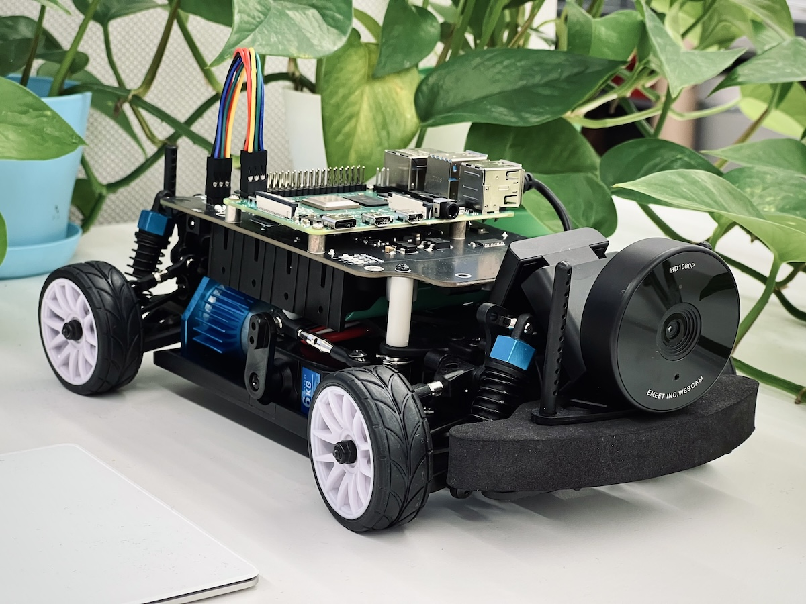
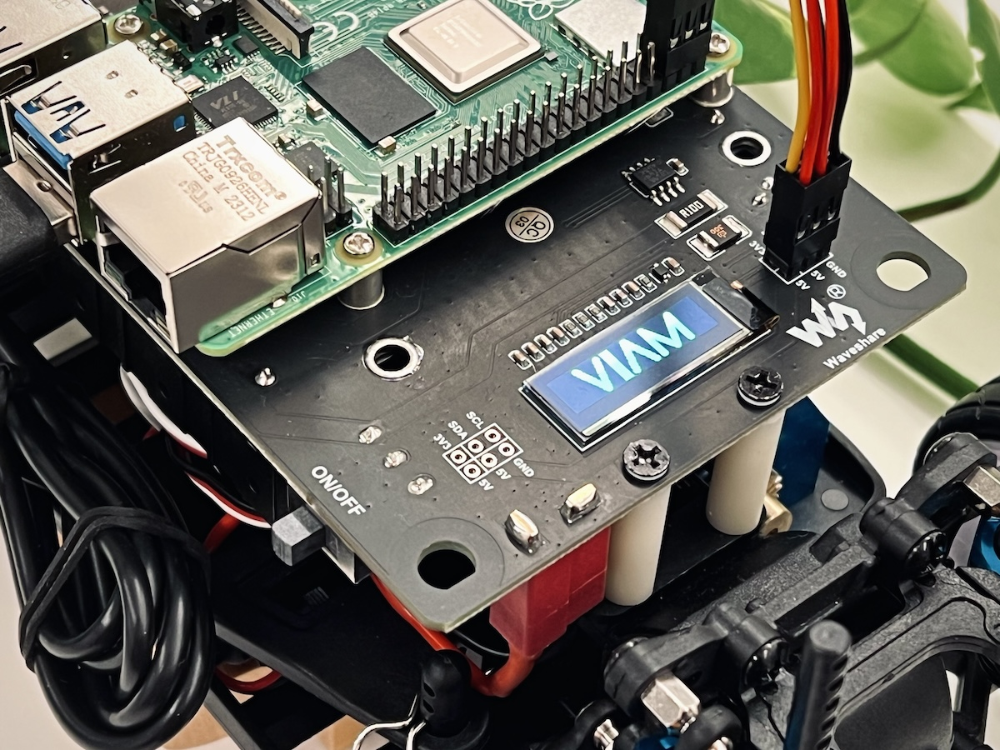
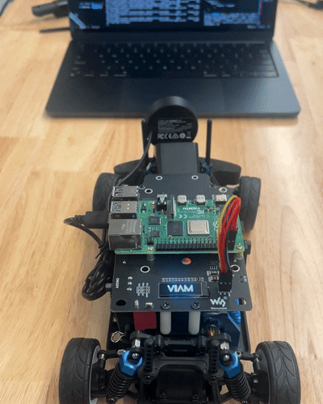
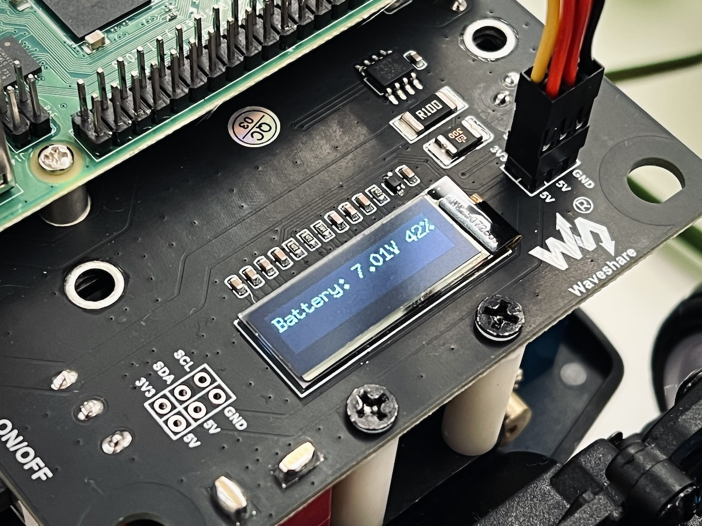

# Hawkeye

Hawkeye is a Viam-powered RC car that tracks tennis balls. It's built on top of the [Waveshare PiRacer Pro](https://www.waveshare.com/product/piracer-pro-ai-kit.htm) kit using Viam software to control the hardware.

For Viam developers: the machine configuration is defined under [`viam-dev/Evgeni/hawkeye`](https://app.viam.com/machine/28bc42b7-1b89-4adc-b695-446b18d96ba1/configure).



## Terminology

| Term            | Definition                                                                                                                                                                                                                                                                                                         |
| --------------- | ------------------------------------------------------------------------------------------------------------------------------------------------------------------------------------------------------------------------------------------------------------------------------------------------------------------ |
| Hawkeye         | The software that controls the hardware. Consists of the machine defined on the Viam platform ([`viam-dev/Evgeni/hawkeye`](https://app.viam.com/machine/28bc42b7-1b89-4adc-b695-446b18d96ba1/configure)) and the business logic in this repo to integrate the hardware components and track their state.           |
| PiRacer         | The pre-built RC car kit that contains all of the hardware components.                                                                                                                                                                                                                                             |
| Raspberry Pi    | The onboard computer that sits on top of the PiRacer. Its hostname is `piracer` in the examples below.                                                                                                                                                                                                             |
| Expansion board | The board that sits between the batteries and the Raspberry Pi on the PiRacer. It contains a PCA9685 PWM driver (16 PWM channels over I2C), an INA219 power monitor for reading battery voltage, the main power switch, and the BMS (Battery Management System) that protects the batteries.                       |
| PWM             | Pulse Width Modulation. A digital square wave whose duty cycle (the fraction of each period spent high) encodes an analog value — here, a servo angle or a throttle setpoint. The PCA9685 on the expansion board generates the PWM signals for the steering servo and the ESC.                                     |
| I2C             | A two-wire serial bus (SCL clock + SDA data) for talking to low-speed peripherals. Each device on the bus has its own address. Hawkeye uses three I2C devices on the Pi's default bus: the PCA9685 at `0x40` (PWM driver), the INA219 at `0x42` (battery voltage), and the SSD1306 at `0x3C` (128x32 OLED screen). |
| ESC             | Electronic speed controller. The small black box on the chassis that converts a PWM signal into the drive signals for the brushed motor. Needs an arming signal before it will accept drive commands — see the FAQ at the bottom for details.                                                                      |
| Servo           | A small motor with built-in closed-loop position control. It takes a PWM signal and holds the corresponding angle. The PiRacer uses one servo for steering; the ESC's drive output is also controlled like a servo (PWM in, throttle out), which is why both show up as `servo` in the Viam config.                |
| Motor           | The brushed DC motor that drives the rear wheels through the differential. Powered by the ESC.                                                                                                                                                                                                                     |

## Overview

### Architecture

Hawkeye is organized around **routines** — independent units of behavior that each own a hardware component. There are five of them:

| Routine    | Hardware             | What it does                                                                           |
| ---------- | -------------------- | -------------------------------------------------------------------------------------- |
| `vision`   | camera               | Asks the Viam vision service for tennis-ball detections and publishes the largest one. |
| `steering` | steering servo       | Centers the steering on the latest detection's pixel-X.                                |
| `motor`    | ESC (as a servo)     | Drives the motor at a speed derived from the detection's bounding-box area.            |
| `screen`   | SSD1306 OLED         | Redraws the OLED with battery voltage, a rolling tennis ball, or the Viam logo.        |
| `battery`  | INA219 power monitor | Reads battery voltage on a tick so other routines (like `screen`) can display it.      |

Each routine runs its tick function on a fixed cadence via [`util.Routine`](util/routine.go) and is independently startable, stoppable, and testable. The naming convention is load-bearing: every routine-specific identifier in [src/](src/) starts with the routine name, so `grep vision src/` shows the full surface area of the vision routine in one pass.

Routines communicate through shared state on the `hawkeye` struct — typically `atomic.Pointer` fields like `visionLastDetection` and `batteryLastReading`. For example, the vision routine writes the latest detection; the steering and motor routines each load it on their own tick and decide what to do. This is what makes combinations like `vision + steering + screen` (no motor) work cleanly — each routine just reacts to whatever shared state is currently present.

```text
[vision]  --writes-->  visionLastDetection  --reads-->  [steering]
                                            --reads-->  [motor]
                                            --reads-->  [screen]

[battery] --writes-->  batteryLastReading   --reads-->  [screen]
```

See [CLAUDE.md](CLAUDE.md) for the full convention and the rules for adding a new routine.

### Starting the PiRacer

Toggle the ON/OFF switch on the expansion board by the rear left wheel. You'll see the Raspberry Pi's LEDs turn on and will hear a quick beep indicating that the ESC is receiving power.

The Raspberry Pi and `viam-agent` take 30-40 seconds to fully boot. You'll then see the Viam logo on the screen along with a longer beep indicating that the ESC is armed.



### Invoking commands

Hawkeye registers a single `rdk:service:generic` model (`viam:tennis:hawkeye`) and exposes all of its behavior through `DoCommand`. Every command has the same shape:

```jsonc
{
  "command":  "start" | "stop" | "test",
  "routines": { "<routine>": { "<args>" } }
}
```

- `start` / `stop` can address multiple routines in one call — they're dispatched in deterministic (sorted-key) order, best-effort, so a failure in one routine doesn't skip the others.
- `test` requires exactly one routine and runs synchronously. It's meant for ad-hoc hardware exercises (sweep the steering, drive forward for a second, draw a tennis ball at a given rotation) and may block while it runs.

From the CLI, an invocation looks like:

```bash
viam robot part run \
  --robot "<robot id>" --part "<part id>" \
  --data '{ "command": "start", "routines": { "vision": {} } }' \
  viam.service.generic.v1.GenericService/DoCommand
```

A few useful examples:

```jsonc
⚠️ Heads up! Starting the motor routine will usually make the PiRacer move.
Make sure the wheels are suspended in the air or that you have ample space.

ℹ️ Per-routine argument shapes and their defaults & validation rules live in src/command_args.go.

// Start the full autonomous tracking loop: vision detects, steering centers on the ball,
// motor drives toward it, screen shows the rolling tennis ball animation.
{ "command": "start", "routines": { "vision": {}, "steering": {}, "motor": {}, "screen": {} } }

// Less functionality: vision detects, steering centers on the tennis ball,
// screen shows the rolling tennis ball animation. No motor. See gif below.
{ "command": "start", "routines": { "vision": {}, "steering": {}, "screen": {} } }

// Stop everything and let the steering servo recenter.
{ "command": "stop", "routines": { "vision": {}, "steering": {}, "motor": {}, "screen": {} } }

// Drive the motor forward at 30% power for 2 seconds without involving vision.
{ "command": "test", "routines": { "motor": { "direction": "forward", "power": 3, "duration_secs": 2 } } }

// Sweep the steering through left, right, neutral once.
{ "command": "test", "routines": { "steering": {} } }

// Start the battery routine to log the battery level along with the screen routine. Test
// the battery to render it on the OLED screen for 10 seconds (default). See image below.
{ "command": "start", "routines": { "battery": {}, "screen": {} } }
{ "command": "test",  "routines": { "battery": {} } }
```





### Viam dependencies

The module declares four required dependencies in its Viam config:

| Field            | Viam component         | Purpose                               |
| ---------------- | ---------------------- | ------------------------------------- |
| `camera`         | `rdk:component:camera` | Source frames for the vision service. |
| `vision`         | `rdk:service:vision`   | Tennis ball detector.                 |
| `servo_steering` | `rdk:component:servo`  | Steering servo.                       |
| `servo_motor`    | `rdk:component:servo`  | ESC, configured as a servo.           |

Validation and reconfiguration behavior for these dependencies lives in [src/init.go](src/init.go). The matching robot-config snippet — the `services` and `modules` entries that declare these names — lives in the comment block in [Makefile](Makefile).

## Developing and testing

### Working with Claude

Hawkeye is built primarily with Claude Code. [CLAUDE.md](CLAUDE.md) is what keeps Claude on-pattern — it documents the routine model, the load-bearing naming convention, the `DoCommand` shape, and the conventions around logging, error wrapping, and `Reconfigure`. When you add a new routine or change the shape of an existing one, update CLAUDE.md too so future prompts stay grounded.

When prompting Claude, lean on the terminology established in this README and in the code. Precise terms map directly to the existing patterns and get you a working scaffold; vague ones don't:

- Routine names (`vision`, `steering`, `motor`, `screen`, `battery`) trigger the naming convention — Claude will produce the right struct fields, handlers, `argsStart/Stop/Test` types, constants block, and dispatcher cases without further nudging.
- Hardware vocabulary from the [Terminology](#terminology) table (ESC, servo, PWM, I2C, INA219, SSD1306, PCA9685) is much more precise than "the wheels" or "the screen".
- Constant names like `MOTOR_FORWARD_HIGH` or `STEERING_MAX_LEFT` are useful when discussing calibration — they're empirical values and named for a reason.

For example, _"add a temperature routine that reads from the screen's I2C bus and writes to a `temperatureReading` atomic pointer"_ gets you a working scaffold; _"add a temperature thing"_ does not.

### Deploying to the PiRacer

For quick iteration, the [Makefile](Makefile) provides a fast cross-compile-and-deploy loop:

```bash
make deploy-remote
```

This cross-compiles the module for `linux/arm64` in Docker, stops `viam-agent` on the PiRacer, scps the binary to `/home/piracer/bin/run`, and restarts the agent. The matching Viam robot config snippet — the `services` and `modules` entries that point at `/home/piracer/bin/run` — lives in the comment block in the Makefile.

To avoid typing the PiRacer's ssh password on every deploy, do this once:

```bash
ssh-keygen -t ed25519  # only if ~/.ssh/id_ed25519 doesn't already exist
ssh-copy-id piracer@piracer.local
```

After deploying, invoke routines using the payloads from [Invoking commands](#invoking-commands) and tail the logs with `sudo journalctl -u viam-agent -f` from [Debugging viam-agent](#debugging-viam-agent) to verify the change took effect.

See the rest of the Makefile for formal Viam registry releases.

## Low-level debugging and testing

You can ssh into the PiRacer to work with `viam-agent` and the `hawkeye` module directly. This is convenient for viewing `viam-agent` logs without going to app.viam.com and for debugging locally if something isn't working and observability is limited.

```bash
ssh piracer@piracer.local
# - Make sure your laptop is on the Viam-5G network like the PiRacer host.
# - Ask Evgeni for the PiRacer's password.
```

### Debugging viam-agent

| Description                    | Command                                                |
| ------------------------------ | ------------------------------------------------------ |
| Start viam-agent               | `sudo systemctl start viam-agent`                      |
| Stop viam-agent                | `sudo systemctl stop viam-agent`                       |
| Check viam-agent's status      | `sudo systemctl status viam-agent`                     |
| Check viam-agent's logs        | `sudo journalctl -u viam-agent -f`                     |
| View viam-agent's service file | `cat /usr/local/lib/systemd/system/viam-agent.service` |
| View viam-agent's JSON config  | `cat /etc/viam.json`                                   |

### Testing functionality locally without Viam

⚠️ **First make sure the PiRacer's wheel aren't touching the ground.**

Then you can copy the files in `scripts` to the PiRacer host:

```bash
ssh piracer@piracer.local "mkdir -p /home/piracer/scripts"
scp scripts piracer@piracer.local:/home/piracer/scripts
```

And run them on the PiRacer:

```bash
piracer@piracer:~ $ python3 scripts/some_script.py
```

### FAQ and troubleshooting

**Q**: What kind of batteries do I need?

**A**: The PiRacer takes four rechargeable, flat top 18650 batteries. Make sure they're the **flat top** kind. The regular ones will be a very tight fit for the battery case and may not work at all. These ones work perfectly: [Samsung 25R from 18650BatteryStore](https://www.18650batterystore.com/products/samsung-25r-18650). If you're having power issues, see the next question for common fixes.

**Q**: My PiRacer won't turn on when I turn the expansion board's switch on. What do I do?

**A**: There can be a few sources of PiRacer power issues. First, make sure that you're using batteries similar to the ones mentioned above in the answer above, they're fully charged, and they're plugged in using the correct orientations.

If you connected the Raspberry Pi according to the [GPIO pinout map](https://pinout.xyz/) and its LEDs aren't blinking, it's likely that you tripped the PiRacer's expansion board's BMS (battery management system) fault at some point. This could happen if you used the wrong type of batteries, used fewer than four batteries, used the wrong battery orientation, plugged in the board without batteries, etc. The exact conditions aren't well-documented.

The recommended way to reset the BMS is to turn the expansion board's switch off, insert all four batteries with the correct orientation, **plug the PiRacer's 8.4V port into the outlet**, and then flip the switch on. If the Raspberry Pi still doesn't turn on, double check that the Pi itself works by disconnecting it from the expansion board and powering it separately using its USB-C charger. Beyond that, try debugging with different batteries, a different order of powering things on, powering the board without batteries, or reaching out to Waveshare for support.

If the Raspberry Pi turned on but the steering and wheels aren't working, make sure you turn the switch on for the small black box under the expansion board. See the next question for more details on this.

**Q**: There's a small black box on the chassis of the car that beeped once and is now flashing red every second. What's that about?

**A**: That's the ESC (electronic speed controller). It's the hardware that controls the servo (steering) and motor (wheels). The beep means that the ESC is powered on and the flashing red light means it's waiting for an arming signal before it can control the servo and motor. When the Raspberry Pi boots with `viam-agent`, the configured `servo` component in `viam-agent` will automatically send an arming signal. You'll hear a longer beep and the red light will stop blinking when this happens, indicating that the ESC is ready to go.

See `scripts/drive_forward_and_back.py` for a low-level implementation of arming the ESC.

**Q**: Why's it called hawkeye?

From the [Hawk-Eye electronic line calling system](https://en.wikipedia.org/wiki/Hawk-Eye) used in the big tennis tournaments :)
